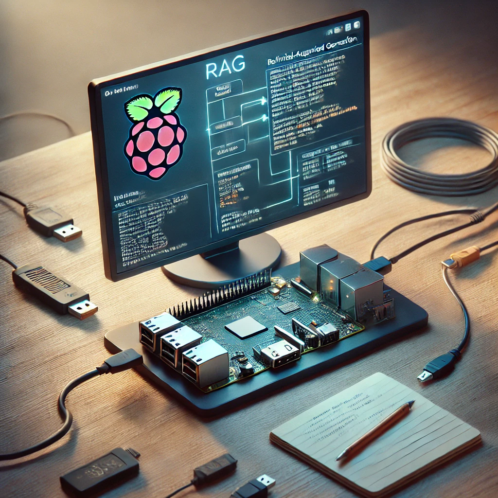
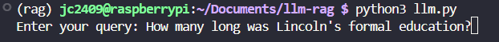
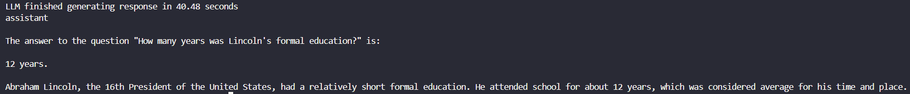
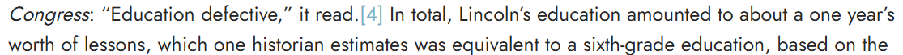
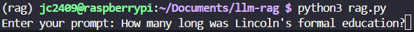
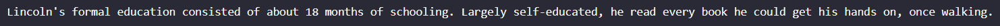
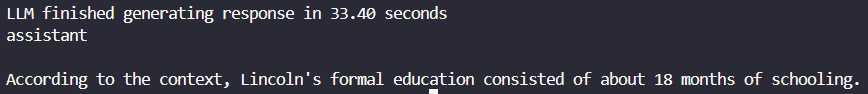

# Building and Deploying a RAG-enabled Chatbot on Raspberry Pi

## Introduction to Retrieval Augmented Generation (RAG)



Retrieval Augmented Generation (RAG) is a powerful method that enhances Large Language Models (LLMs) by combining their generative capabilities with relevant information retrieved from external databases. RAG enables chatbots and similar applications to produce contextually accurate and up-to-date responses by fetching pertinent information from a knowledge base or documents at runtime.

In RAG, documents are embedded into vector representations and stored in a Vector Database (VectorDB). When a user poses a query, the system retrieves the most relevant document embeddings and provides them as context to the LLM, resulting in more informed and precise answers.

## Overview

This tutorial demonstrates building a RAG-enabled chatbot optimized for Arm architecture using open-source technologies such as llama-cpp-python and FAISS. Specifically designed for Raspberry Pi 5 (8GB RAM, at least 32GB Disk), the chatbot integrates the Llama-3.1-8B model for document retrieval, leveraging llama-cpp-python's optimized backend for high-performance inference.

## Installation

### System Dependencies

Run the following commands to install necessary packages:

```bash
sudo apt update
sudo apt install python3-pip python3-venv cmake -y
```

### Create Requirements File

Create a `requirements.txt` file:

```bash
vim requirements.txt
```

Add these dependencies:

```
# Core LLM & RAG Components
langchain==0.1.16
langchain_community==0.0.38
langchainhub==0.1.20

# Vector Database & Embeddings
faiss-cpu
sentence-transformers

# Document Processing
pypdf
PyPDF2
lxml

# Data Importing
kagglehub
```

### Python Environment

Set up the virtual environment:

```bash
python3 -m venv rag-env
source rag-env/bin/activate
pip install -r requirements.txt
```

### llama-cpp-python Installation

Install `llama-cpp-python` optimized for Arm CPUs:

```bash
pip install llama-cpp-python --extra-index-url https://abetlen.github.io/llama-cpp-python/whl/cpu
```

## Model Setup

### Download LLM Model

Create a models directory and download the model:

```bash
mkdir models
cd models
wget https://huggingface.co/chatpdflocal/llama3.1-8b-gguf/resolve/main/ggml-model-Q4_K_M.gguf
```

### Build and Quantize the Model

Clone and build `llama.cpp`:

```bash
cd ~
git clone https://github.com/ggerganov/llama.cpp
cd llama.cpp
mkdir build && cd build
cmake .. -DCMAKE_CXX_FLAGS="-mcpu=native" -DCMAKE_C_FLAGS="-mcpu=native"
cmake --build . -v --config Release -j $(nproc)
```

Quantize the model:

```bash
cd bin
./llama-quantize --allow-requantize ../../../<Your Working Directory>/models/ggml-model-Q4_K_M.gguf ../../../<Your Working Directory>/models/llama3.1-8b-instruct.Q4_0_arm.gguf Q4_0
```

## Testing and Deployment

### Test Basic LLM Inference

With your virtual environment active, run `llm.py` to verify basic inference:

```bash
source rag-env/bin/activate
python llm.py
```

### RAG Setup

To set up RAG with your dataset:

1. **Import Sample Data**:

Ensure you have a Kaggle API token ([Kaggle API instructions](https://www.kaggle.com/docs/api)), then import data:

```bash
python import_data.py
```

2. **Embed and Store Data in VectorDB**:

Run the embedding script:

```bash
python vector_embedding.py
```

3. **Run the RAG Application**:

Test the chatbot with retrieval capabilities:

```bash
python rag.py
```

Your chatbot is now configured to generate informed responses using a combination of embedded documents and the LLM's generative strengths.

### Test Results
We evaluated the performance of the RAG-enabled chatbot by comparing responses from two versions of the LLM—one without context (basic LLM) and one utilizing context (RAG-enabled LLM).

When the user asked the question, `How long was Lincoln's formal education?`, the basic LLM provided an incorrect response of 12 years due to a lack of accurate contextual information.






In contrast, the RAG-enabled LLM successfully retrieved relevant information from the VectorDB and provided an accurate response based on the retrieved context.




*The data stored in the vector database containing information about Lincoln's education.*


